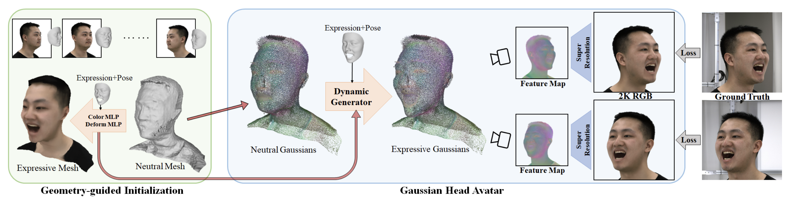
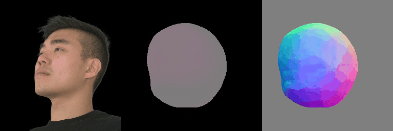
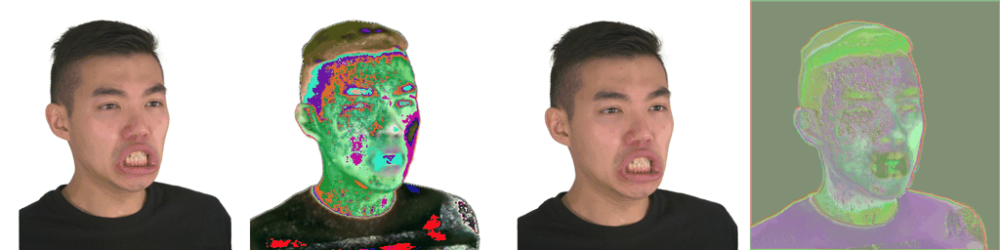

 # Final Project Report

## 1 Abstract

Our project aimed to create a high-fidelity 3D head avatars using a combination of neutral 3D Gaussians and a fully leaned MLP-based deformation field. Our model can capture intricate dynamic details while maintaining expression precision. What's more, for the stability and convergence of the training procedure, we devise a well-designed initialization strategy guided by geometry, leveraging implicit SDF and Deep Marching Tetrahedra.

## 2 Technical Approach

We begin by removing the background from each image and simultaneously estimating the 3DMM model, 3D facial landmarks, and expression coefficients for every frame. During the initialization phase in 2.1,  we reconstruct a neutral geometry based on Signed Distance Fields (SDF). Additionally, we refine a deformation MLP and a color MLP using training data to create a guidance model. Subsequently, we initialize the neutral Gaussians using the neutral mesh extracted through DMTet, while the deformation and color MLPs are also inherited from this stage.

   

Above is the prepocess on Jian Yu's face.

Moving on to the training phase in Section 2.2, we utilize the dynamic generator to deform the neutral Gaussians to the target expression, leveraging the driving expression coefficients as conditions.

Ultimately, with a specified camera perspective, the expressive Gaussians undergo rendering to produce a feature map. This feature map subsequently serves as input to the convolutional super-resolution network, tasked with generating high-resolution avatar images. The optimization of the entire model occurs under the guidance of supervision from multi-view RGB videos.

### 2.1 Geometry-guided Initialization

We are familiar with how to start a neural networks but Gaussians are quite different. Random initialization will hard to converge. 

To overcome this, we propose utilizing an implicit Signed Distance Field (SDF) representation and Deep Marching Tetrahedra (DMTet) to reconstruct a neutral mesh for Gaussian position initialization. Furthermore, rough optimization is applied to the color and deformation MLPs.

We build MLPs to initialize parameters $f_{col}^{exp}, f_{col}^{pose}, f_{def}^{exp}, f_{def}^{pose}$ using a deformation MLP and a color MLP. During training, constraints are introduced to prevent overfitting: 

1. Offset regularization $L_{offset}$ penalizes non-zero displacements to prevent learning a global constant offset; 
2. Landmark regularization $L_{lmk}$restricts SDF values near 3D landmarks to be close to zero, ensuring landmarks are on the mesh surface; 
3. Laplacian regularization $L_{lap}$​ maintains mesh smoothness. 

The overall loss function is formulated as:
$$
\mathcal{L}_{total} = \mathcal{L}_{RGB}+\lambda_{sil} \mathcal{L}_{sil} + \lambda_{def} \mathcal{L}_{def} + \lambda_{offset} \mathcal{L}_{offset} + \lambda_{lmk} \mathcal{L}_{lmk} + \lambda_{lap} \mathcal{L}_{lap}
$$

$$
\mathcal{L}_{RGB} = ||I_{r,g,b}-I_{gt}||_1
\\\mathcal{L}_{sil} = IOU(M,M_{gt})\\
P=P_0+f_{def}^{exp}(P_0,\theta)\\
\mathcal{L}_{def} = ||P-P_{gt}||_1
$$
Where $\lambda$ represents the weight of each term. The MLPs, along with the neutral 3D landmarks $P_0$, are jointly optimized until convergence.

Then, we use the optimized results to attributes:$\{f_{col}^{exp},f_{col}^{pose}, f_{def}^{exp},f_{def}^{pose}\}$. And other attributes we just follow the original strategy.

### 2.2 Training

#### 2.2.1 Training Pipeline
In order to compute loss, in each iteration, we firstly generate the head avatar, then we render a 32-channel image with 512 resolution $I_C\in R^{512*512*32}$. Thirdly, we feed the image to a super resolution network $\Psi$ generating a image $I_{hr}\in R_{2048*2048*3}$ which can show more details. All parameters including $\{X_0,F_0,Q_0,S_0,A_0\}$, $\{f_{col}^{exp},f_{col}^{pose}, f_{def}^{exp},f_{def}^{pose}, f_{att}^{exp},f_{att}^{pose}\}$, and $\Psi$.

#### 2.2.2 Loss Function
$$
L=||I_{hr}-I_{gt}||_1+\lambda_{vgg}VGG(I_{hr},I_{gt})+\lambda_{lr}||I_{lr}+I_{gt}||_1.
$$
$\lambda$ is weight. $I_{lr}$ is the first three channels of the 32-channel image $I_C$. $VGG$ is the VGG loss and $I_{gt} $ is the ground truth.

### 2.3 Avatar Representation

Our goal is to generate a dynamic head avatar controlled by expression coefficients. To achieve this, we represent the head avatar as dynamic 3D Gaussians conditioned on expressions. To accommodate dynamic changes, we incorporate expression coefficients and head pose as inputs to the head avatar model, which then outputs the position and other attributes of the Gaussians accordingly.

This is the pipeline of the paper we refer to:

Firstly, we build a neutral Gaussian model with expression-independent attributes: $\{X_0,F_0,Q_0,S_0,A_0\}$. While $X_0\in R^{N*3}$ is the position of the Gaussians in the canonical space, $F_0\in R^{N*128}$ is the point-wise feature vectors as their inherent attribute, $Q_0\in R^{N*4}$ is neutral rotation, $S_0\in R^{N*3}$ is the scale of the Gaussians, and $A_0\in R^{N*1}$ is opacity. Then, using MPL-based deformation field, we generate a dynamic head avatar with expression coefficients: $\{X,F,Q,S,A\}=\phi(X_0,F_0,Q_0,S_0,A_0;\theta,\beta)$. $\theta$ represents the expression coefficients, and $\beta$ is the head pose. During training, we optimize the parameters of the model to minimize the difference between the generated head avatar and the ground truth.

Then, we will furthur explain how to update $\{X,F,Q,S,A\}$ through $\phi$.

For $X$,we assume the displacement is related to the expression and the head pose, which show as $f_{def}^{exp}\in\phi$ and $f_{def}^{pose}\in\phi$respectively. Then we add them to the neutral position : 
$$
X'=X_0+\lambda_{exp}(X_0)f_{def}^{exp}(X_0,\theta)+\lambda_{pose}(X_0)f_{def}^{pose}(X_0,\beta)
$$
The two $\lambda$ are the weights of the expression and the head pose. We can calculate $\lambda_{exp}$ as follows.
$$
\lambda_{exp}=\begin{cases}
1, &\text{dist}(x,P_0)<t_1\\
\frac{t_2-\text{dist}(x,P_0)}{t_2-t_1}, &\text{dist}(x,P_0)\in[t_1,t_2]\\
0,&\text{dist}(x,P_0)>t_2
\end{cases}
$$
and $\lambda_{pose}(x)=1-\lambda_{exp}(x)$. $dist(x,P_0)$ is the minimum distance between $x$ and the the 3D landmarks $P_0$. $t_1$ and $t_2$​ are the predefined hyperparmaeters when the length of the head is set to approximately 1.

Instead of using linear function, we also tried to add some sigmoid-like function on it. That's because:

1. Speaking from experience with masking and weight drawing, the general weight matrix is very sparse, with epidermal vertices overwhelmingly influenced by the nearest bone. Skeleton manipulation of meshes is similar to mesh manipulation of Gaussians.
2. It may be more in keeping with the body's natural.

For $C$, color will directly predict by two color MLPs:
$$
C'=\lambda_{exp}(X_0)f_{col}^{exp}(F_0,\theta)+\lambda_{pose}(X_0)f_{col}^{pose}(X_0,\beta)
$$
For $Q$, $S$ and $A$, we similarly use another two MLPs to predict the rotation, scale and opacity:
$$
\{Q',S',A'\}=\{Q_0,S_0,A_0\}+\lambda_{exp}(X_0)f_{att}^{exp}(F_0,\theta)+\lambda_{pose}(X_0)f_{att}^{pose}(Q_0,\beta)
$$

Lastly, we need to transform form canonical space to the real world space. Only direction related variables need to be changed. So we have 
$$
\{X,Q\}=T(\{X',Q'\},\beta),
$$
$$
\{C,S,A\}=\{C',S',A'\}
$$

### 2.4 Problems

* The training process was too slow, and although our results were trained on an existing dataset, it was too late to train it after we created our own data.
* The work we referenced is so advanced (CVPR 2024) that it's hard for us to make big improvements on it. We only modified some parameters to make them more reasonable and tried to create our own dataset.

### 2.5 Lessons Learned

In this project, we have chosen a recent piece of work to reproduce. We learnt a great deal about pytorch as well as about 3D reconstruction, gradually learning about cutting-edge directions such as Gaussian Splatting.

When making adjustments to parameters, thorough deliberation is paramount, particularly given the extensive training times characteristic of a model of such magnitude. Deviating from the optimal direction could lead to significant time wastage, as rectifying errors and rerunning experiments can be exceptionally time-consuming.

Furthermore, it's imperative to craft a comprehensive and flexible plan with generous time allocations. Unforeseen complications are inevitable, and they often demand more time than initially anticipated. For example, delving into the intricacies of the original codebase can prove to be far more challenging than initially imagined. Additionally, there can be a considerable disparity between the current state of the art in research papers and the knowledge base at our disposal. Such disparities may necessitate additional time for learning and adaptation, underscoring the importance of a well-padded timeline.

## 3 Results

We first use images and cameras to model the head in exist dataset:

  

Then convert it into gaussian model:

Use another person's head to reenactment our avater:

The right side is the trained avatar, the left side is making a new movement making the right head mimic the left one.

## 4 References

* Papers

Xu, Yuelang, et al. "Gaussian head avatar: Ultra high-fidelity head avatar via dynamic gaussians." *arXiv preprint arXiv:2312.03029* (2023).

Gerig, Thomas, et al. "Morphable face models-an open framework." *2018 13th IEEE international conference on automatic face & gesture recognition (FG 2018)*. IEEE, 2018.

* Websites

https://github.com/YuelangX/Gaussian-Head-Avatar

https://github.com/YuelangX/Multiview-3DMM-Fitting/tree/main

https://flame.is.tue.mpg.de/

## 5 Contributions from each team member
